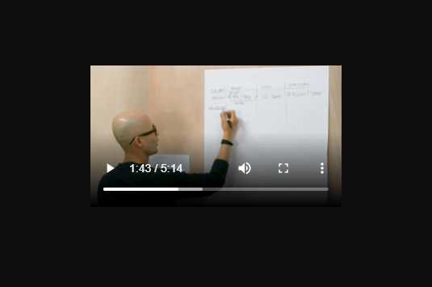

# VideoStreaming

Experimental video streaming service. This is broken down into two very basic Micsorservices, to be used as the basis of a small streaming service. This is no production ready and would need many tweaks, this is only a basic prototype consisting of two services (a Client and an API).

# Usage

Run: ````docker-compose up --build -d````

To check log output: ````docker logs ${container-name} -f ````

Default Port: ```3000```

